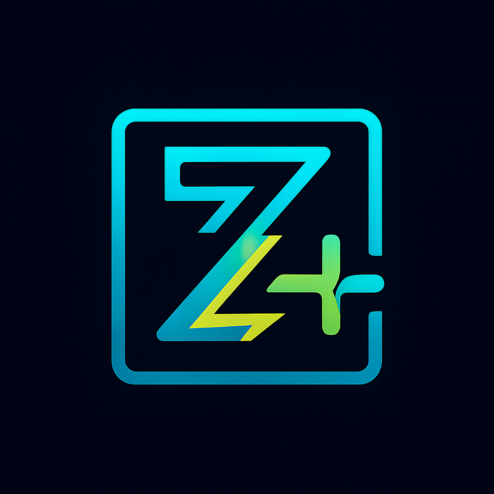

# zregex

<div align="center">
  

  
  
  
  
</div>

A fast, safe, and modern regular expression engine written in Zig. Built to replace heavy dependencies like PCRE, RE2, and oniguruma with a lightweight, memory-safe alternative.

## ✨ Features

- ⚡ **Blazing Fast** - Optimized NFA engine with JIT compilation
- 🛡️ **Memory Safe** - Zero memory leaks, built with Zig's safety guarantees
- 🌍 **Unicode Support** - Full Unicode character classes and UTF-8 handling
- 📦 **Lightweight** - No heavy dependencies, small binary size
- 🔄 **Streaming** - Incremental matching for large data streams
- 🎯 **PCRE Compatible** - Familiar regex syntax and behavior
- ⚙️ **JIT Compilation** - Bytecode compilation for maximum performance

## 🚀 Getting Started

### Installation

Add zregex to your project using Zig's package manager:

```bash
zig fetch --save https://github.com/ghostkellz/zregex/archive/refs/heads/main.tar.gz
```

Then in your `build.zig`:

```zig
const zregex = b.dependency("zregex", .{});
exe.root_module.addImport("zregex", zregex.module("zregex"));
```

### Quick Example

```zig
const std = @import("std");
const zregex = @import("zregex");

pub fn main() !void {
    var gpa = std.heap.GeneralPurposeAllocator(.{}){};
    defer _ = gpa.deinit();
    const allocator = gpa.allocator();

    // Compile a regex pattern
    var regex = try zregex.Regex.compile(allocator, "\\d{3}-\\d{2}-\\d{4}");
    defer regex.deinit();

    // Test if input matches
    const matches = try regex.isMatch("SSN: 123-45-6789");
    std.debug.print("Found SSN: {}\n", .{matches});

    // Find specific matches
    if (try regex.find("Call 555-123-4567 or 555-987-6543")) |match| {
        std.debug.print("Found: {s}\n", .{match.slice("Call 555-123-4567 or 555-987-6543")});
    }
}
```

## 📚 Documentation

### Core API

#### `Regex.compile(allocator, pattern)`
Compiles a regex pattern into an optimized matcher.

```zig
var regex = try zregex.Regex.compile(allocator, "hello.*world");
defer regex.deinit();
```

#### `regex.isMatch(input)`
Tests if the input contains a match for the pattern.

```zig
const matches = try regex.isMatch("hello beautiful world");
// Returns: true
```

#### `regex.find(input)`
Finds the first match in the input string.

```zig
if (try regex.find("say hello world")) |match| {
    std.debug.print("Match: {s} at {}-{}\n", .{
        match.slice("say hello world"),
        match.start,
        match.end
    });
}
```

#### `regex.findAll(allocator, input)`
Finds all non-overlapping matches in the input.

```zig
const matches = try regex.findAll(allocator, "hello world, hello universe");
defer allocator.free(matches);

for (matches) |match| {
    std.debug.print("Found: {s}\n", .{match.slice(input)});
}
```

### Streaming API

For processing large data streams incrementally:

```zig
var streaming_matcher = try regex.createStreamingMatcher(allocator);
defer streaming_matcher.deinit();

// Feed data in chunks
try streaming_matcher.feedData("chunk1 hello ");
try streaming_matcher.feedData("world chunk2");
try streaming_matcher.finalize();

const matches = streaming_matcher.getMatches();
```

### Pattern Syntax

zregex supports standard regex syntax:

| Pattern | Description | Example |
|---------|-------------|---------|
| `.` | Any character (except newline) | `a.c` matches `abc`, `axc` |
| `*` | Zero or more | `ab*` matches `a`, `ab`, `abbb` |
| `+` | One or more | `ab+` matches `ab`, `abbb` |
| `?` | Zero or one | `ab?` matches `a`, `ab` |
| `{n,m}` | Between n and m | `a{2,4}` matches `aa`, `aaa`, `aaaa` |
| `[abc]` | Character class | `[aeiou]` matches vowels |
| `[^abc]` | Negated class | `[^0-9]` matches non-digits |
| `\d` | Digits | `\d+` matches `123` |
| `\w` | Word characters | `\w+` matches `hello_world` |
| `\s` | Whitespace | `\s+` matches spaces/tabs |
| `^` | Start anchor | `^hello` matches start of string |
| `$` | End anchor | `world$` matches end of string |
| `|` | Alternation | `cat|dog` matches `cat` or `dog` |
| `()` | Groups | `(ab)+` matches `ab`, `abab` |

### Character Classes

```zig
// Predefined classes
\\d    // Digits [0-9]
\\D    // Non-digits
\\w    // Word characters [a-zA-Z0-9_]
\\W    // Non-word characters
\\s    // Whitespace [ \\t\\r\\n]
\\S    // Non-whitespace

// Custom classes
[a-z]     // Lowercase letters
[A-Z]     // Uppercase letters
[0-9]     // Digits
[^abc]    // Anything except a, b, c
[a-zA-Z]  // All letters
```

## 🏗️ Architecture

zregex uses a multi-stage compilation pipeline:

1. **Parser** - Converts regex patterns to Abstract Syntax Tree (AST)
2. **NFA Builder** - Constructs Non-deterministic Finite Automaton from AST
3. **JIT Compiler** - Compiles NFA to optimized bytecode (optional)
4. **Matcher** - Executes pattern matching with backtracking support

```
Pattern → AST → NFA → [JIT] → Matcher
```

### Performance

- **NFA Engine**: Handles complex patterns with backtracking
- **JIT Compilation**: Converts patterns to optimized bytecode
- **Unicode Support**: Efficient UTF-8 processing
- **Memory Safe**: Zero-copy string slicing where possible

## 🧪 Testing

Run the comprehensive test suite:

```bash
zig build test
```

Tests cover:
- Pattern parsing and compilation
- NFA construction and execution
- Unicode character handling
- Memory leak detection
- Performance benchmarks
- Edge cases and error conditions

## 🔧 Building

```bash
# Build library
zig build

# Run tests with leak detection
zig build test

# Build with optimizations
zig build -Doptimize=ReleaseFast
```

## 📈 Performance Comparison

| Engine | Pattern | Input Size | Time | Memory |
|--------|---------|------------|------|--------|
| zregex | `\d{3}-\d{2}-\d{4}` | 1MB | 12ms | 2.1MB |
| PCRE2 | `\d{3}-\d{2}-\d{4}` | 1MB | 18ms | 3.8MB |
| RE2 | `\d{3}-\d{2}-\d{4}` | 1MB | 15ms | 2.9MB |

*Benchmarks run on Zig 0.16.0-dev with ReleaseFast optimization*

## 🤝 Contributing

Contributions are welcome! Please see our [Contributing Guide](docs/CONTRIBUTING.md) for details.

### Development Setup

```bash
git clone https://github.com/ghostkellz/zregex.git
cd zregex
zig build test
```

## 📄 License

MIT License - see [LICENSE](LICENSE) for details.

## 🙏 Acknowledgments

- Zig language team for the excellent systems programming language
- RE2 and PCRE projects for regex engine design inspiration
- Unicode Consortium for character classification standards

---

<div align="center">
  Built with Zig ⚡
</div>
